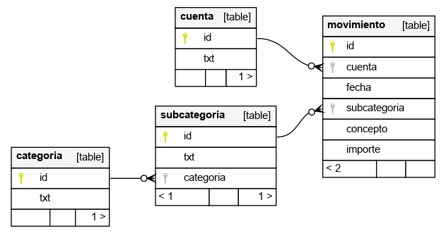

# ing-to-sql

Transforma los xls de movimientos de ING a una [base de datos sqlite](sql/schema.sql):

## Requisitos

Tener descargados los movimientos de ING en Excels cuyo nombre
empieze por `YYYYY` o `_YYYY` donde `YYYY` es el año al que se refieren.

En caso de que un año este troceado en varios Excel, los nombres
de dichos archivos deben coincidir con el orden cronológico,
por ejemplo `2010a.xls` contendrá movimientos anteriores a `2010b.xls`.

No importa si dos Excel se solapan (por ejemplo, que `2010a.xls` vaya
de enero al 30 de junio y `2010b.xls` del 1 de junio a diciembre), ya
que los movimientos duplicados se descartan.
